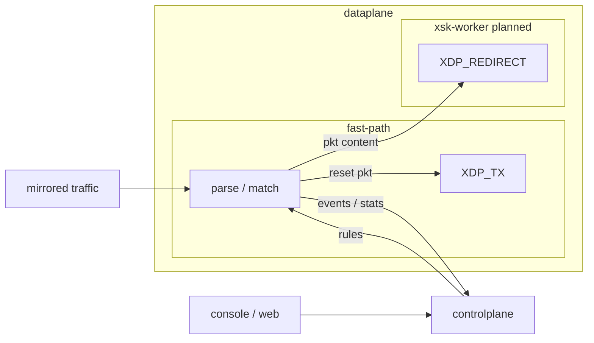

# sidersp

Lightweight side-path traffic pre-decision and active response service.

[中文](README.zh-CN.md) | English

## Features

- XDP-based ingress handling for mirrored traffic
- Lightweight rule loading, validation, and synchronization
- Synchronous TCP reset response via XDP_TX
- XSK redirect path for future user-space spoof responses
- Ringbuf observation event output
- Basic Web console for status, rules, and statistics

## Architecture



- `dataplane`: XDP packet parsing, rule matching, action execution, event output, and XSK redirect.
- `controlplane`: rule/config loading, runtime state, statistics aggregation, and coordination.
- `console` / `web`: REST API and lightweight management UI.
- `config`, `rule`, and `model`: shared local configuration, rule schema, and data models used by the active modules.
- `specs/`: system contracts for modules, rules, events, and response semantics.

## Requirements

- Linux with XDP/eBPF support
- Go `1.25.5+`
- `clang` / LLVM for rebuilding BPF objects
- Root or equivalent capabilities for loading BPF and attaching XDP
- A dedicated mirrored-traffic network interface

## Quick Start

Edit the interface in `configs/config.example.yaml` first:

```yaml
dataplane:
  interface: eth0
  attach_mode: generic
```

Build and run:

```bash
make build-all
sudo ./build/sidersp -config configs/config.example.yaml
```

Or use the Makefile shortcut:

```bash
sudo make run CONFIG=./configs/config.example.yaml
```

Run unit tests:

```bash
make test
```

Build a release package:

```bash
make package VERSION=0.1.0
```

Install from the extracted release package on the target host:

```bash
tar -xzf sidersp-0.1.0-linux-amd64.tar.gz
cd sidersp-0.1.0-linux-amd64
sudo scripts/install-systemd.sh
```

See [docs/deployment.md](docs/deployment.md) for upgrade, rollback, uninstall,
logs, dynamic log-level changes, and attach-mode notes.

Run BPF tests on a suitable Linux environment:

```bash
make test-bpf
```

## Layout

```text
cmd/        service entrypoint
internal/   Go implementation modules
bpf/        XDP/BPF C sources
configs/    example and local configs
specs/      system contracts
docs/       technical notes
web/        management UI
skills/     local agent guidance
```

## Scope

Current focus:

- Mirrored-traffic ingress handling
- Rule-driven classification and action selection
- TCP reset response
- Event/statistics visibility
- Basic management UI

Not included yet:

- Full AF_XDP user-space TX worker
- Deep analysis backend integration
- Persistent database storage
- Distributed deployment or clustering
- Production-grade policy orchestration
