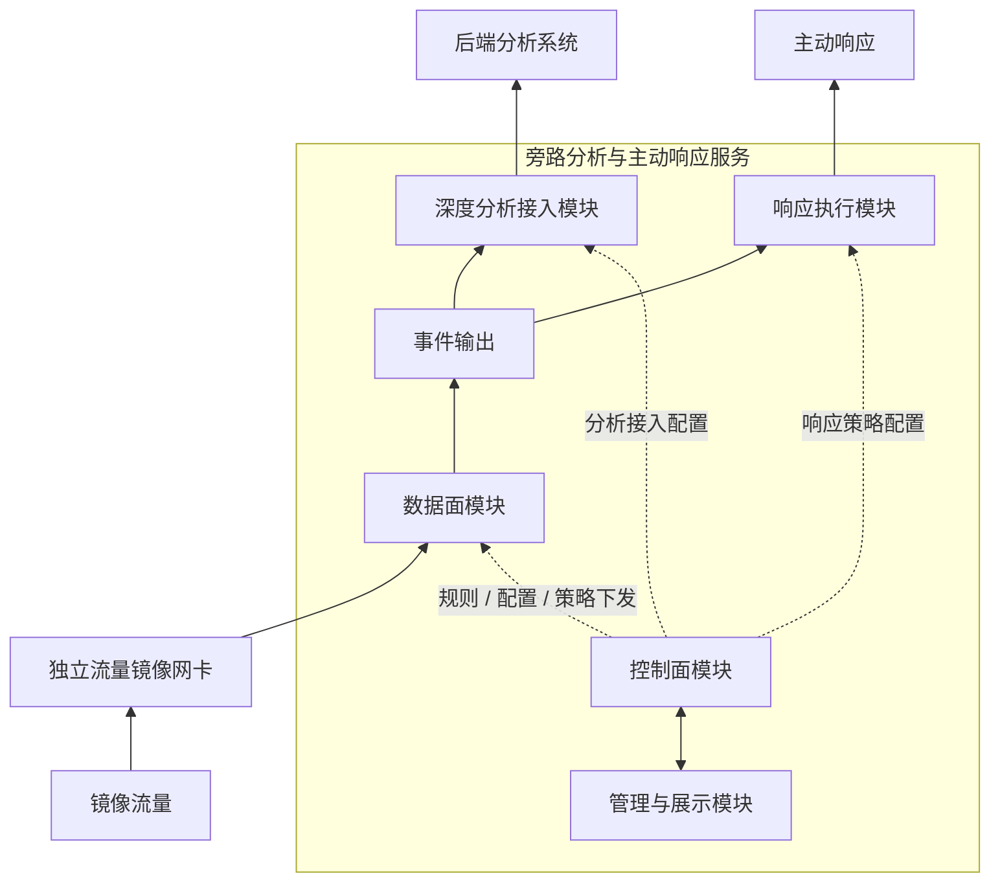

# 旁路分析与主动响应服务

一个面向镜像流量场景的前置裁决与响应编排服务。

## 定位

作为旁路流量入口侧的前置裁决层，负责在后端分析之前完成识别、分类、分流、事件提取和响应触发。

## 特性

- 入口侧前置裁决
- 轻量规则驱动
- 流量分类与分流
- 统一事件输出
- 主动响应触发
- 基础状态可视化

## 架构

## 环境

- OS
  - Ubuntu 22.04+
  - Debian 11+
  - RHEL 9+
- NIC
  - 独立流量镜像网卡