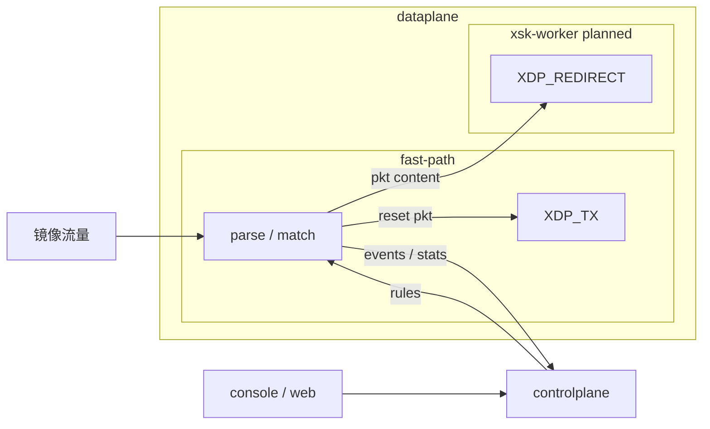

# sidersp

轻量级旁路流量前置裁决与主动响应服务。

中文 | [English](README.md)

## 功能

- 基于 XDP 的镜像流量入口处理
- 轻量规则加载、校验和同步
- TCP reset 同步 XDP_TX 响应
- XSK 重定向通道，用于后续用户态 spoof 响应
- ringbuf 观测事件输出
- 基础状态、规则和统计 Web 管理页

## 架构



- `dataplane`：XDP 包解析、规则匹配、action 执行、事件输出和 XSK redirect。
- `controlplane`：规则/配置加载、运行状态维护、统计聚合和流程协调。
- `console` / `web`：REST API 和轻量管理页面。
- `config`、`rule` 和 `model`：当前模块共享的本地配置、规则 schema 和数据模型。
- `specs/`：模块、规则、事件和响应语义的系统合约。

## 运行要求

- 支持 XDP/eBPF 的 Linux 环境
- Go `1.25.5+`
- 重新构建 BPF 对象时需要 `clang` / LLVM
- 加载 BPF 和挂载 XDP 需要 root 或等价权限
- 独立的镜像流量网卡

## 快速开始

先修改 `configs/config.example.yaml` 中的网卡名：

```yaml
dataplane:
  interface: eth0
  attach_mode: generic
```

构建并运行：

```bash
make build-all
sudo ./build/sidersp -config configs/config.example.yaml
```

也可以使用 Makefile：

```bash
sudo make run CONFIG=./configs/config.example.yaml
```

运行单元测试：

```bash
make test
```

在合适的 Linux 环境运行 BPF 测试：

```bash
make test-bpf
```

## 目录结构

```text
cmd/        服务入口
internal/   Go 实现模块
bpf/        XDP/BPF C 源码
configs/    示例和本地配置
specs/      系统合约
docs/       技术说明
web/        管理页面
skills/     本地 agent 指引
```

## 范围

当前聚焦：

- 镜像流量入口处理
- 基于规则的分类和动作选择
- TCP reset 响应
- 事件和统计可视化
- 基础管理页面

暂不包含：

- 完整 AF_XDP 用户态 TX worker
- 深度分析后端接入
- 持久化数据库存储
- 分布式部署或集群能力
- 生产级策略编排
